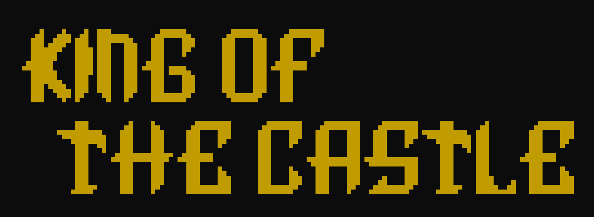

## Introducción                                                        
King of the Castle es un videojuego de rol (RPG) por turnos desarrollado en su totalidad en C#. Este proyecto surgió originalmente como una consigna en  julio-agosto de 2024, y fue mejroado en enero de 2026.

El objetivo principal de esta implementación es poner a prueba y demostrar conocimientos escenciales en Programación Orientada a Objetos (POO).

## Conocimientos aplicados 

En estre trabajo logro utilizar conocimiento que fui adquiriendo a lo largo del cursado, como por ejemplo lo puede ser  la herencia, el encapsulamiento y la abstracción;  mientras se aplican los principios SOLID.  
Además sirvio para aprender disitntas técnoligias aplicadas  en C# como es el consumo de API y el manejo de archivos JSON 

## Acerca del juego 
King of the castle es un juego de combate por turnos, el cual el juegador tiene como objetivo convertise en el rey del castillo. Esto se logra derrotando 10 oleadas de enemigos de forma continua.Miesntas se van derratando enemigos el jugador obtiene una mejora dependiendo del enemigo al que se enfrente. Pero antes de empezar a jugar el jugador debera elegir entre 3 clases:
- **Hada**:Fragil pero gracias su diminuta altura y alta velocidad puede evitar muchos golpes
- **Centauro**: Logra aguantar unos cuantes golpes y con cierta agilidad se mueve evitando algunos ataques
- **Ogro**:Debido a su gran tamaño se le complica movese velozmente lo cual queda extramadamente vulnerable a los golpes enemigos. Pero lo compensa con su gran capacidad de recibir golpes

## Bibliografía 
- [API utilizada para nombre de los enemigos](https://randomuser.me/api/)  
- [Pagina utlizada para generar los titulos](https://patorjk.com/software/taag/)
- [Pagina usada de donde obtuve las ilustraciones ](https://www.asciiart.eu)  
- [Inteligendia artificial como ayuda para realizar las mejoras](https://gemini.google.com/)